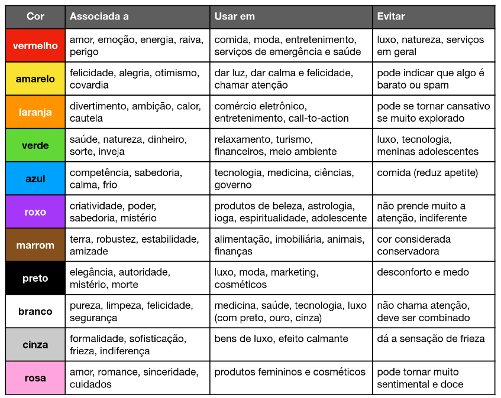
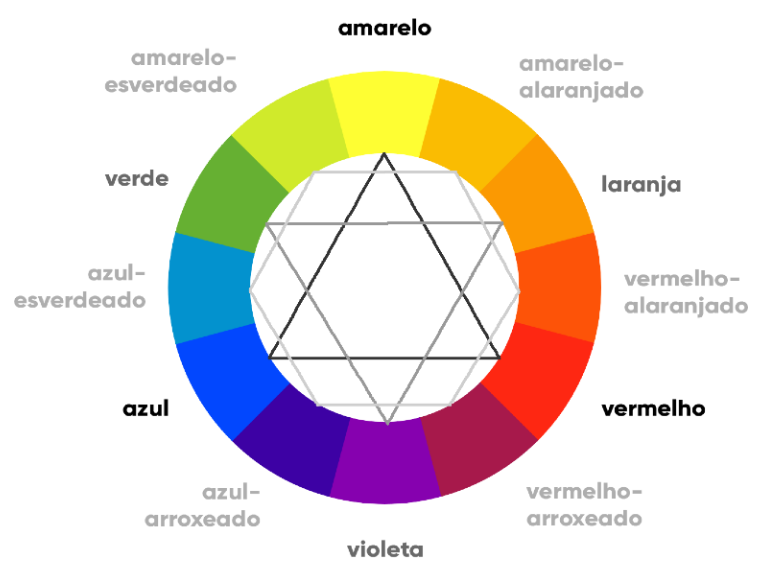

# Módulo 2 - Curso em Vídeo - HTML5+CSS3

## Cap 13 - Cores

### Psicologia das cores

Cores, para além de estilização da página, assumem também um papel central na percepção da identidade da marca, que, quando bem utilizado, provoca uma atração consistente com os valores da mesma.

Existe um conceito chamado "[Psicologia das Cores](https://rockcontent.com/br/blog/psicologia-das-cores/)" o qual busca explicar os sentimentos e associações que as pessoas fazem, em média, a determinada cor:

> Mais conteúdos sobre cores:
> - [Psicologia das Cores - Guia Avançado](https://www.matildefilmes.com.br/psicologia-das-cores-guia-avancado-para-profissionais/)
> - [Psicologia das Cores - Aplicação no Marketing](https://neilpatel.com/br/blog/psicologia-das-cores-como-usar-cores-para-aumentar-sua-taxa-de-conversao/)

---

### Círculo cromático

O círculo cromático é uma forma de visualizar as diferentes cores em um esquema circular, similar a este:

Nele é representado as **cores primáricas**: \[Azul, Vermelho e Amarelo\] e a partir disso as cores **secundárias** \[Verde, Violeta, Laranja\] e **terciárias**.

